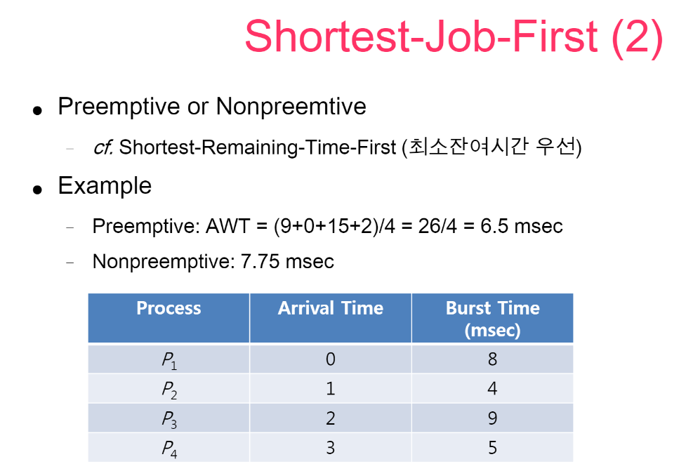
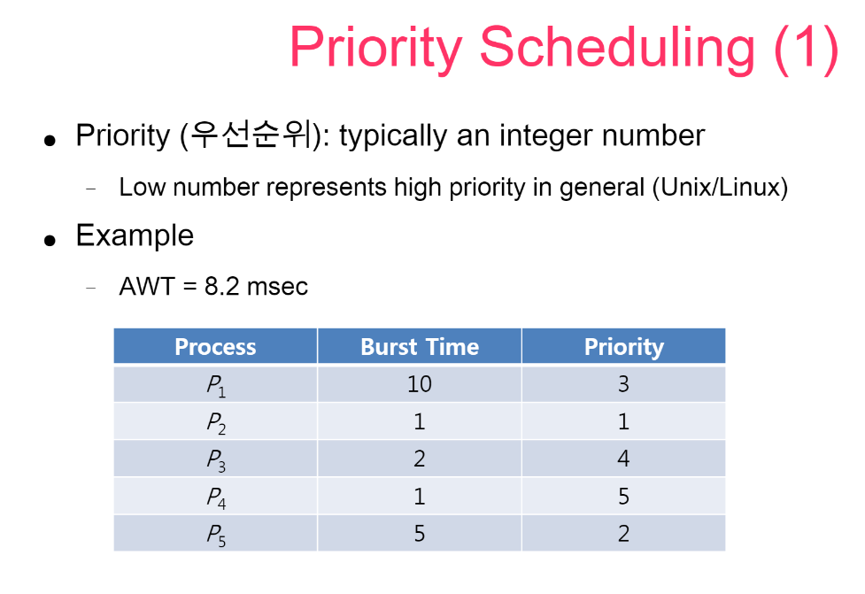

# CPU 스케줄링 알고리즘

[toc]

## 0. 프로세스 상태

1. new: 새로운 프로세스 생성
2. ready: 프로세스 실행을 위한 준비 완료
3. running: 프로세스 실행중
4. waiting: 어떤 추가적인 interrupt를 기다리는 상태
5. terminated: 프로세스가 완전히 종료되고, 나머지 정리 작업들을 실행(PCB 제거, 메모리 반환 등)

#### PCB(Process Control Block)

-> 작업관리자 / RAMMAP

## 1. 스케줄링이란

> OS에서 여러가지 처리 요청들을 어떤 순서대로 처리할 지 결정하는 것.
>
> 어떻게 하면 CPU 자원을 최대한 효율적으로 사용할 수 있을까?라는 물음에서 스케줄링이 시작되었다.

위치에 따른 3 가지 스케줄링: job scheduling, cpu scheduling, device scheduling 

### 1-1. job 스케줄링

> *Job Queue: 하드디스크에서 메인 메모리로 올라오려면 줄서서 대기하는 공간. 
>
> Job Queue에 대기하고 있는 것들 중에서 어떤 것을 먼저 메인 메모리에 올릴 것인지 결정하는 알고리즘을 뜻한다.

- 일반적으로 (CPU에 비해 상대적으로 긴 '분' 단위)긴 시간에 걸쳐 일어나기 때문에 `long term 스케줄러`라고도 한다.

### 1-2. CPU 스케줄링

> *Ready Queue: 메인 메모리에서 CPU 서비스를 받기 위해 대기하는 공간.
>
> Ready Queue 안에 대기하고 있는 것들 중에서 어떤 것을 먼저 CPU 서비스를 받도록 할 것인지 결정하는 알고리즘을 뜻한다.

- `Short term 스케줄러`라고도 한다.

### 1-3. Device 스케줄링

> 메인 메모리에서 디스크로 backing store하는 것을 처리하는 알고리즘을 말한다.
>
> 메모리 -> Device: Swap out
>
> Device -> 메모리 Swap in

- `Middle term 스케줄러`라고도 한다.

**Job scheduling, CPU scheduling, device scheduling 등 컴퓨터 자원을 효율적으로 사용하도록 하는 것이 OS의 주요 역할 중 하나이다.**

## 2. 선점 스케줄링 / 비선점 스케줄링

### 비선점 스케줄링

> 프로세스가 CPU할당을 한 번 받으면 끝날 때까지 나머지 프로세스들은 대기한다. 
>
> CPU가 해당 프로세스를 다 끝내고 종료하고 나서야 다음 프로세스를 실행한다. 

종류

- FCFS: 도착한 순서에 따라 CPU를 할당
- SJF: 실행시간이 가장 짧은 것부터 처리
- Priority: 우선순위가 높은 것부터 처리 

### 선점 스케줄링

> CPU가 어떤 프로세스에 의해 점유중일 때, 우선순위가 높은 프로세스가 CPU를 차지할 수 있음.

- 이때, 기존에 진행되고 있었지만 우선순위에서 밀린 프로세스는 대기 상태로 돌입함. 
- 우선순위가 높은 프로세스를 빠르게 처리 해야 하는 상황에서 유리함
- 그러나 선점이 일어날 경우, 오버헤드가 발생하여 처리시간을 정확히 예측하기가 어렵다는 단점이 있다.
  - Context는 CPU가 프로세스를 실행하기 위해 필요한 해당 프로세스의 정보이다. 이것은 PCB에 담겨 있다.
  - 프로세스를 변경할 때에는 Switching Context라는 것이 발생하는데 이때마다 오버헤드가 계속 누적된다. 따라서 CPU의 프로세스 처리 속도를 예측하는 것이 어렵다.

참고: [Context Switch가 무엇인가?](https://jeong-pro.tistory.com/93)

종류

- SRT: 현재 실행중인 프로세스의 남은 시간과 준비상태 큐에 있는 프로세스의 시간을 계속 비교하여 가장 짧은 실행시간인 프로세스부터 처리하는 방법.
- 선점 우선순위: 준비상태에 새롭게 들어온 프로세스가 현재 진행상태의 프로세스 우선순위보다 높은 경우 선점.
- RR(Round Robin): 시간 할당량 동안만 실행한 후 완료되지 않으면 다음 프로세스에게 CPU 양보하고 자신은 준비상태의 Queue의 맨 뒤에 위치. 
- 다단계 큐(멀티레벨 큐)
- 다단계 피드백 큐(멀티레벨 피드백 큐)

## 3. CPU 스케줄링 알고리즘

### 스케줄링 알고리즘의 척도

> 알고리즘의 성능을 비교하려면 그 기준이 되는 것이 필요한데, 그것을 스케줄링 척도라고 한다.

1. Cpu utilization(단위: %) - cpu 이용률
   - cpu가 놀지 않고 얼마나 일을 많이 하는가?
   - cpu 이용률이 높을 수록 좋은 알고리즘으로 평가

2. Throughput (단위: jobs/sec) - 처리율
   - 시간 당 처리한 작업의 수
   - 처리율이 높을 수록 좋은 알고리즘으로 평가

3. Turnaround time - 반환 시간

   - 작업을 시작한 뒤부터 끝날 때까지 걸린 시간
   - 짧을 수록 좋은 성능으로 평가

4. Waiting time - 대기 시간

   - cpu 서비스를 받기 위해 기다리는 시간

   - 짧을 수록 좋은 성능으로 평가

5. Response time - 응답 시간

   - 처음 응답이 나올 때까지 걸리는 시간 

   - 짧을 수록 좋은 성능으로 평가

## 3-1. FCFS 알고리즘

> First Come First Served
>
> 먼저 들어온 것을 먼저 처리

- 특징 1. Simple & Fair : 단순하고 일반적으로 공평한 방식
- 효율성은 때에 따라 좋을 수도 안좋을 수도 있다.

호위 효과란, 처리하는데 오랜 시간이 걸리는 p1 뒤로 p2, p3가 대기하고 있는 것이 마치 p1을 호위하는 것과 같아 보인다는 뜻에서 호위효과라고 한다.

3개의 작업을 처리하는데 걸리는 시간이 총 30msec.

이 중에서 평균대기시간(AWT) 17msec는 많이 길어 보인다.

만약 p3 - p2 - p1순으로 처리했다면, AWT는 0+3+6/3 = 3msec이 된다. 

## 3-2. SJF 알고리즘

> Shortest Job First (혹은 SRT: Shortest Remaining Time)
>
> 작업 시간이 짧은 것부터 먼저 처리 

- 특징 1. 가장 효율적. 대기시간을 줄이는데에는 가장 효율적인 알고리즘이다. 

- 특징 2. 비현실적. 그러나, 하나의 프로세스가 cpu를 얼마나 사용할 지를 아는 것은 어렵기 때문에 비현실적이다.

## 3-3. Priority 알고리즘

> 우선순위가 높은 것부터 먼저 처리
>
> 문제점: starving, starvation. 계속해서 새로 들어오는 프로세스의 우선순위가 이전에 들어온 것보다 높다면, 이전에 들어온 것은 무한 대기 상태에 빠지게 된다.
>
> 해결방법: aging. 시간이 지날수록 처리되지 않은 프로세스들의 우선순위를 조금씩 높여주는 방식을 aging이라고 한다.

---

References

[양햄찌가 만드는 세상- [운영체제]Swapping 스와핑(Swap 스왑)이란? 프로세스 교체, VMM과 차이 ](https://jhnyang.tistory.com/103)

[양햄찌가 만드는 세상- [운영체제]PCB (Process Control Block)란? PCB 정보 & Context Switching 문맥교환 & Overhead 오버헤드 ](https://jhnyang.tistory.com/33)

[컴알못도 단번에 이해하는 컴퓨터 노예비유법](http://www.inven.co.kr/board/webzine/2097/1492961)

[그저 그런 컴공생 - CPU 스케줄링](https://bnzn2426.tistory.com/65)

[Procus-프로세스 스레드의 차이, PCB/TCB](https://www.crocus.co.kr/1403)

[RAMMAP](https://docs.microsoft.com/ko-kr/sysinternals/downloads/rammap)