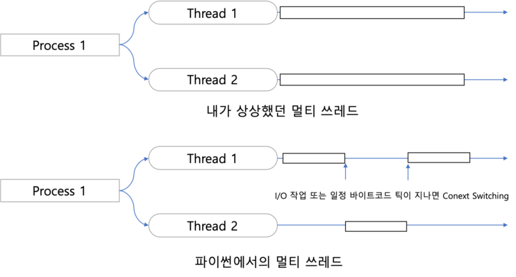

# 모니터 (Monitor)

> 세마포어(Semaphore)를 응용한 고수준의 프로세스 동기화 도구

세마포어 개념만을 적용하여 **임계구역 문제**를 해결하고자 하면 프로그래머의 역량이 상당히 중요하다.

이에 따라 나타날 수 있는 역량차이, 코드의 복잡성 등의 문제를 해결하기 위해 고급 언어 (ex. JAVA)에서 제공하며 사용되는 **동기화 도구**이다.


## 세마포어와 모니터

| 구분      | 세마포어                  | 모니터                                                |
| --------- | ------------------------- | ----------------------------------------------------- |
| 필요 조건 | 개발자의 역량 필요        | 고급 프로그래밍 언어                                  |
| 상호 작용 | 모니터의 기본 이론 (이진) | 타이밍 오류 및 편의성 보완                            |
| 구현 방법 | 변수 활용을 통한 연산     | Java : **synchronized** Object<br/>.net의 모니터 활용 |


## 모니터의 기본


- Entry Set = queue의 자료구조로 **배타동기**의 역할을 한다.
- Wait Set = queue의 자료구조로 **조건동기**의 역할을 한다.
- The Owner = 하나의 자료 혹은 함수는 하나의 모니터를 갖는다. 1 공유자원 = 1 모니터
- **모니터 내부의 자원은 쓰레드가 직접적으로 조작할 수 없다.**

---

1. The Owner가 필요한 쓰레드는 Entry Set에 들어온다.
   1. 하나의 쓰레드만 공유 자원 영역에 들어갈 수 있다.
2. 공유 자원 영역이 비어있다면 Entry Set의 첫번째 쓰레드가 공유 자원을 사용한다.
3. 다음 쓰레드를 위해 일정 작업 수행 이후 Wait Set에 들어간다.
4. 이전 쓰레드가 공유 자원을 모두 사용했고 Wait Set에 쓰레드가 있다면 Wait Set의 첫번째 쓰레드가 공유 자원 영역에 들어간다.
5. 공유 자원을 앞으로 더 쓸 일이 없다면 어느 Set에도 들어가지 않고 종료한다.


## 자바에서 모니터

- **synchronized** : 클래스, 변수, 메서드에 사용되는 자바의 제어자로 공유 자원이라는 의미를 부여한다.
  - **synchronized** 하나만으로 모니터를 구현하여 상호배타의 조건은 충족한다.

---

### 모니터에서 사용되는 연산은 Wait와 Signal이 있다.

- **wait()** : 쓰레드의 공유자원 사용이 끝나고 다음에 다시 사용을 위해 대기상태 ( Wait Set)으로 들어가는 자바 메서드이다.
- **notify(), notifyAll()** : Wait Set에 있는 쓰레드에게 공유자원 사용이 끝났다는 것을 알리는 메서드
  - notify() : 하나의 쓰레드만 깨워서 불러온다.
  - notifyAll() : Wait Set에 있는 모든 쓰레드를 깨운 후 하드웨어, 모니터, queue, 코드 등에 따라 공유자원영역으로 들어올 쓰레드가 정해진다.


## 모니터 예시

### 생산자 - 소비자 문제

생산자 - 소비자 문제를 빵집, 빵집 주인, 손님으로 대입해서 생각해봅시다.

빵집에 트레이는 단 2개 뿐이고 가득 차 있으면 **주인(생산자)**이 쉬고 비어있다면 **손님(소비자)**이 쉽니다.

```java
public static void main(String[] args){ // == if name == '__main__':
    //쓰레드 실행
}

public static class 빵집{
    // 편의상 이렇게 썼습니다.
    트레이리스트 = []
    // 트레이 2개
    트레이개수 = 2;
    
    // 빵집 주인을 위한 함수
    public void 빵만들기(){
        // 계속
        while(true){
            // 모니터 장착 (해당 함수를 모니터로 보호해서 상호배타 구현)
            synchronized (this){
                // 트레이가 차있어서 빵을 만들 필요가 없다.
                while(트레이가 꽉 차있다.){
                    // 해당 함수를 실행하는 쓰레드는 대기상태(Wait Set) 
                    wait();
                }
                // 트레이가 안 차있다면 위의 함수를 실행하지 않고 내려온다
                // 진짜 빵만들기 시작
                트레이리스트에 빵 추가;
                
                // 빵 만들었다고 알려주기
                notify();
            }
        }
    } // 빵집 주인 함수 끝
    
    // 빵집 손님을 위한 함수
    public void 빵구입(){
        while(true){
            synchonized(this){
                // 트레이리스트의 length == 0
                while(트레이가 비어있다.){
                    // 손님들은 기다린다.
                    wait();
                }
                // 빵이 있다면 위의 함수를 실행하지 않고 내려온다.
                // 빵 구입
                트레이리스트에서 앞에 있는 1개 빼기;
                // = queue.pop(0)
                
                // 빵 샀어요.
                notify()                
            }
        }
    }
}
```


### 파이썬은?

> 파이썬도 객체지향 언어지만 모니터 관련 언급이 없어서 찾아봤습니다.

#### GIL (Global Interpreter Lock) =  전역 인터프리터 잠금

위의 모니터의 예시는 동기화 쓰레딩이여서 1번에 1개의 쓰레드가 실행이 됐습니다.

하지만 코드를 어떻게 조작하는지에 따라 임계구역 외의 작업은 동시에 수행을 하는 멀티 쓰레드가 구현이 됩니다.

파이썬에선 **GIL**때문에 멀티 쓰레드를 구현하려고 하면 속도와 효율성 저하가 발생할 수 있습니다.



파이썬의 쓰레드에선 임계구역과 그 외 자원의 구분없이 하나의 쓰레드가 자원을 모두 차지합니다. 그래서 임계구역 외의 작업을 하더라도 **같은 프로세스 내 다른 쓰레드는 대기상태가 됩니다.**

이런저런 코딩 방법과 모듈로 편법처럼 구현은 가능하지만 코드의 규모에 따라 효율에서 차이가 난다고 합니다.

[파이썬 멀티스레드에 대한 고찰][https://www.jeffknupp.com/blog/2012/03/31/pythons-hardest-problem/]

```text
...Python experts have crafted a standard answer: "Do not use multiple threads. Use multiple processes"...
```
