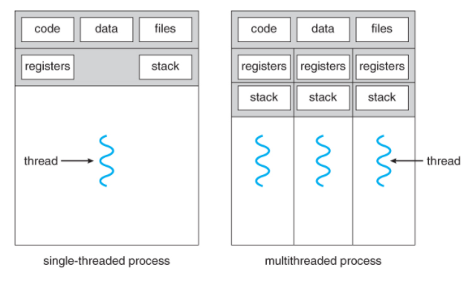
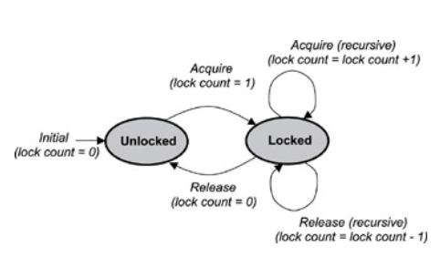
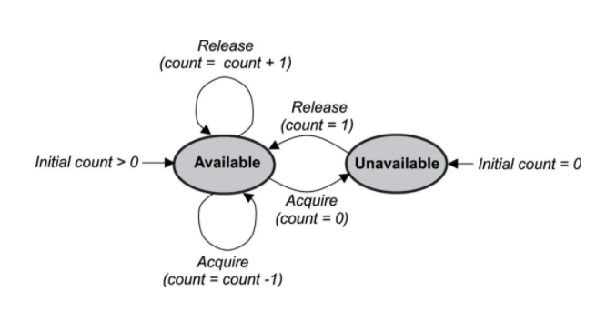
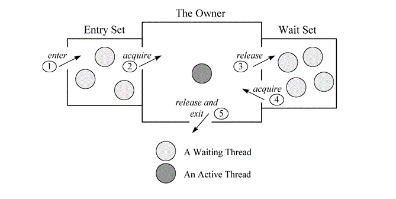

# 프로세스 동기화


## 목차

###### 프로세스, 뭐였더라?

​	→ 프로세스
​	→ 쓰레드, 멀티 쓰레드 🧷

###### 프로세스 동기화, 왜 해야 하나요?

​	→ 프로세스 간 `경쟁상태`에 있기 때문에
​	→`임계구역 문제`를 해결하기 위해 🧷
​		⇒ `교착상태(deadlock)` 발생 방지
​	→ `프로세스 실행 순서를 제어`하기 위해

###### 프로세스 동기화, 어떤 문제 상황이 있을까?

​	→ 식사하는 철학자 문제
​		⇒ `데드락`
​	→ 생산자/소비자 문제 🧷
​		⇒ `유한 버퍼`, `바쁜 대기`
​	→ 독자/저자 문제
​		⇒ `효율성`

###### 프로세스 동기화, 어떤 알고리즘으로 해결하나요?

​	→ `뮤텍스`
​	→ `세마포어` 🧷
​	→ `모니터`


## 프로세스Process

* 실행 중에 있는 프로그램
* Code / Data / Heap / Stack 영역을 가지고 있다.


## 쓰레드Thread

* 프로그램 내부의 "맥", 즉 작업의 흐름. 일종의 단위!
  * 프로세스 내부에는 스레드가 최소 한 개 존재한다.
* `프로세스 스케줄링` 에서 프로세스 단위로 스케줄링 하는 법을 배웠다. 하지만 오늘날의 운영체제는 프로세스가 아닌 쓰레드 단위로 스위칭한다.

### 다중 쓰레드

* 프로세스 내부에 쓰레드가 한 개 일때는 단일 쓰레드(Single Thread), 여러 개 일 때는 다중 쓰레드(Multi Thread).
* (코어가 하나일 때) 쓰레드는 한 번에 한 개만 실행된다. 즉, 다중 쓰레드일 경우에도 쓰레드는 한 순간에 단 한 가지씩만 실행된다.
  다만, 대단히 촘촘하게 짧은 간격으로 번갈아가며 실행되고 있기 때문에 이용자가 보기에는 동시에 진행되는 것 처럼 보인다.
  * EX 웹 브라우저
    * 화면을 출력하는 쓰레드
    * 데이터를 읽어오는 쓰레드
  * EX 워드 프로세서
    * 화면을 출력하는 쓰레드
    * 키보드를 입력받는 쓰레드
    * 철자, 문법 오류들을 확인하여 빨간 밑줄을 쳐주는 쓰레드

### 쓰레드 구조

* 공유되는 영역 : 프로세스의 `CODE`, `DATA`, `FILES`

* 독립적인 영역 : 프로세스의 `STACK`,  `Register` 등

  


## 프로세스 동기화

> 현대 운영체제에서는 context switcing의 단위가 쓰레드이므로 프로세스 동기화가 실제로는 곧 쓰레드 동기화다.

* 상호 관계에 따라 프로세스를 두 종류로 나눌 수 있다:
  * `Independent` 
    * 서로 아무런 영향을 주고받지 않음
  * `Cooperating`
    * 서로 영향을 주고받으며, 따라서 `임계 구역`에서 이들 간 `경쟁 상태`에 놓이게 된다!

### 임계구역Critical-Section

* 공유 자원 접근을 수행하는 영역

### 경쟁 상태Race Condition

* 여러 개의 프로세스들이 공유 자원에 동시적으로 접근할 때, 접근 타이밍과 순서에 따라 그 결과가 달라지게 돼 `데이터 일관성(Data Consistency)`을 해칠 수 있는 상태

  :bulb: 경쟁 상태 예제는 2부에서!

* 이런 문제가 일어나는 이유가 뭘까?

  * 우리가 입력하는 명령들이 우리의 눈(high level)에는 단일한 명령처럼 보이지만, 실제로는 그렇지 않다.
  * 기계는 프로세스를 처리할 때(low level) 명령들을 더 이상 쪼갤 수 없을 때까지(Atomic Operation) 나누어, 이를 실행 단위로 삼기 때문이다. 

  

따라서, 

* 임계 구역에서 경쟁 상태가 발생하는 문제를 해결하고
* 프로세스 실행 순서를 제어하기 위해

프로세스 동기화를 ~~실행~~설계한다! 


### 임계구역 문제 해결 조건 :bulb: 

> 다음의 세 가지 조건을 만족하도록 프로세스 동기화를 설계하면, 임계 구역에서 문제가 발생하지 않는다!

#### 1. 상호 배타 Mutual Exclusion

* 한 프로세스가 임계 구역에서 작업을 실행하고 있을 때, 다른 프로세스가 임계 구역에 접근하지 못하도록 한다.

#### 2. 진행 Progress

* 임계 구역에서 작업을 실행중인 프로세스가 없을 때, 임계 구역에 진입하고자 하는 프로세스가 여러 개라면 그 실행순서를 정해준다.

#### 3. 유한 대기 Bounded Waiting

* 한 프로세스가 임계 구역에 진입하면, 다른 프로세스들은 해당 프로세스가 임계 구역에서 작업을 마칠 때까지 기다려야 한다. 그러나 너무 오랜 시간을 기다리지 않도록, 일정한 한도를 정해준다. 


----

#### 프로세스 동기화 예제

## 식사하는 철학자 문제  #데드락

```plain text
철학자 다섯이서 원형 식탁에 둘러앉아 생각에 빠지다가, 배고플 땐 밥을 먹는다. 그들의 양쪽엔 각각 젓가락 한 짝씩 놓여있고, 밥을 먹으려 할 땐 다음의 과정을 따른다.

1. 왼쪽 젓가락부터 집어든다. 다른 철학자가 이미 왼쪽 젓가락을 쓰고 있다면 그가 내려놓을 때까지 생각하며 대기한다.
2. 왼쪽을 들었으면 오른쪽 젓가락을 든다. 들 수 없다면 1번과 마찬가지로 들 수 있을 때까지 생각하며 대기한다.
3. 두 젓가락을 모두 들었다면 일정 시간동안 식사를 한다.
4. 식사를 마쳤으면 오른쪽 젓가락을 내려놓고, 그 다음 왼쪽 젓가락을 내려놓는다.
5. 다시 생각하다가 배고프면 1번으로 돌아간다.
```

### 교착상태(Deadlock)

* 프로세스는 실행을 위해 CPU 등 여러 자원을 필요로 하는데, 다른 프로세스가 해당 자원을 사용하고 있으면 대기 상태에 놓인다. 이 때 대기중인 프로세스가 다른 자원을 일부 확보하고 있으면, 다른 프로세스에 대기 현상이 연속으로 일어나 교착 상태에 빠진다.
* 교착 상태가 발생할 때는 네 가지 조건이 필요하다: 이 중 하나라도 어긋나게 만들면 된다!
  1. 상호 배타 : 자원은 한 번에 하나의 프로세스에만 할당될 수 있다.
  2. 보유 및 대기 : 프로세스가 어떤 자원을 가지고 있으면서, 다른 프로세스가 사용 중인 자원을 사용하기 위해 대기하고 있다.
  3. 비선점 : 다른 프로세스가 사용중인 자원을 강제로 빼앗을 수 없다.
  4. 환형 대기 : 2번의 대기 상황이 연쇄되어, 맨 끝 프로세스가 맨 첫 프로세스에 할당된 자원을 필요로 하는 상태가 형성된다.

* 따라서, 방지 / 회피 / 검출 및 복구 / 무시로 이를 해결할 수 있다.


## 생산자-소비자 문제(유한 버퍼 문제)  #데이터불일치 #바쁜대기

>  데이터를 `생산`하고 `소비`하는 과정에서 `버퍼`를 이용할 때 발생한다.

* 생산자 - 소비자(Producer-Consumer):
  * 서버에서 송출한 데이터를 클라이언트에서 수신받는다면, 서버는 생산자 / 클라이언트는 소비자
  * 컴파일러가 내놓은 코드를 어셈블러에서 입력받는다면, 컴파일러는 생산자 / 어셈블러는 소비자
* 버퍼Buffer:
  * 생산자가 소비자에게 데이터를 보낼 때, 이를 임시 저장하는 메모리 구역.
  * 생산자와 소비자의 작업 속도에 차이가 있기 때문에, 원활하게 작업하기 위해 버퍼를 이용한다.
    공유 자원 영역인 버퍼에 동시에 접근할 경우, `임계구역 문제`가 발생한다.
  * 버퍼는 물리적 메모리 상에 존재하고 있으므로, 유한한 크기를 가진다. 
    버퍼가 가득 차면 생산자는 데이터를 저장할 수 없고, 버퍼가 텅 비어있으면 소비자는 데이터를 읽어낼 수 없다.
  

### 데이터 불일치 : 세마포어Semaphore

:bulb: 예제 코드로 해결하기: 2부에서!

### 바쁜 대기 Busy Waiting

* 프로세스가 자원에 대한 접근 권한을 얻기 위해, 접근 조건을 반복적으로 확인하는 일이다. 

  * 일반적으로 무한루프를 돌며 if문의 condition을 체크한다.

* 버퍼가 다 차거나 완전히 비었을 경우, 이를 사용할 때 수 있을 때까지 대기하도록 설계한다면? 이는 CPU를 불필요하게 점유하고 있으므로 자원 낭비의 요인이 된다. 

  * 한 쪽이 대기하는 상황이라면, 재빠르게 프로세스를 전환해주자!

    :bulb: 예제 코드로 해결하기: 2부에서!


## 독자-저자 문제  #효율성

* 독자-저자(Reader-Writer):
  * 데이터를 읽기만 하는 프로세스는 독자
  * 데이터를 읽고 수정하는 프로세스는 저자
* 다수의 독자와 다수의 저자가 하나의 공통 데이터베이스를 사용할 때, 데이터 일관성을 유지하는 동시에 효율성을 추구해보자!
  * 이전의 문제들과 마찬가지로 데이터 베이스를 임계구역으로 지정하고, 한 번에 하나의 프로세스만 접근하도록 하는 `상호 배타	` 방식은 비효율적이다.
    * 독자들은 데이터를 수정하지 않기 때문!
    * 따라서 독자들끼리는 동시에 공통 데이터베이스에 접근할 수 있도록 하고, 저자의 경우에만 상호 배타적으로 접근을 허용한다.


----

#### 프로세스 동기화 문제 해결 알고리즘

## 뮤텍스 Mutex lock

* 상호 배타를 뜻하는 MUTual EXclusion의 줄임말로, lock이라고도 불린다.
* lock을 가진 프로세스만 임계구역에 접근할 수 있다. 임계구역에서 작업이 끝나면 unlock하여 lock을 반환한다. 
  이 lock은 다음 프로세스에 주어진다.
  * 자원을 잠시 점유하였다가 반환하는 개념




## 세마포어Semaphore

> 컴퓨터과학자 다익스트라가 고안한 알고리즘으로, "깃발"을 뜻한다.

* 깃발처럼! 프로세스'들'에게 다음 코드 실행이 가능한지, 대기해야 하는지를 알려주는 솔루션이다.

  :bulb: 예제 코드로 실습하기: 2부에서!

* 세마포어 변수는 동시에 실행 가능한 프로세스의 갯수를 알려준다. 쓰레드들이 자원에 접근을 요청하면 세마포어 변수의 카운트가 하나 줄어든다. 카운트가 0이 될 경우 다음 프로세스는 대기한다. 먼저 임계구역에 진입한 프로세스는 사용을 마친 후 세마포어 카운트를 하나 늘린다. 이를 신호로 대기중인 프로세스가 임계 구역에 접근할 수 있다.

  * 자원의 상태를 나타내는 일종의 변수로, 점유/소유의 개념이 아니다.




## 모니터

* 비교적 최신 도구! 하이 레벨 환경에 적합하다.
* 공유 자원과 이에 접근하는 함수들, 그리고 `배타동기 큐`와 `조건동기 큐` 로 구성된다.

* 배타동기 큐로 인해 공유 자원에는 매 항상 최대 1개의 스레드만 접근 가능하다**(=mutex 보장)**. 만약 접근 중인 스레드가 조건동기로 인해 block 되어 조건동기 큐에 들어가면**(=wait)**, 새로운 스레드가 공유 자원에 접근할 수 있다. 이렇게 들어온 새 스레드는 조건동기 큐에 갇힌 스레드를 깨울 수 있고**(=notify)**, 깨어난 스레드는 현재 공유 자원에 접근 중인 다른 스레드가 없을 때 다시 임계구역에 진입할 수 있다.

