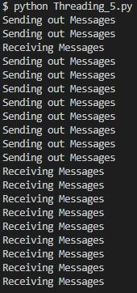
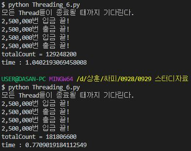
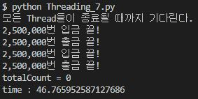
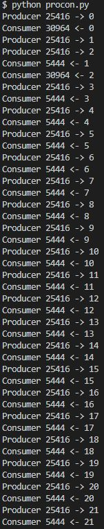
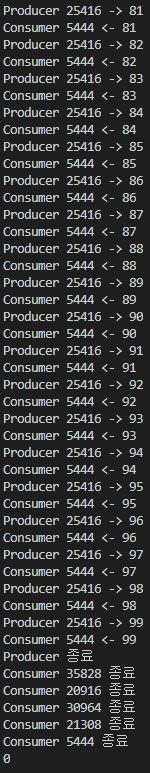

# 6주차 프로세스 동기화

[TOC]

## 0. 프로세스 / 쓰레드 동기화

(참고 : context switching 단위가 스레드인 현대 운영체제에선, 프로세스 동기화를 스레드 동기화로 생각해도 무방하다.)

### 0.1 Python Thread 동기화

프로세스는 하나의 흐름(루틴)을 가지고 있다. 즉, 직렬적으로 한 개의 일을 순서대로 처리한다. 쓰레드를 사용하면 하나의 프로세스 안에서 여러개의 루틴을 만들어 병렬적으로 실행할 수 있다. 단순 반복하는 작업을 분리해서 처리할 수 있다.

쓰레드는 보통 둘 이상의 실행 흐름을 가지고 있기 때문에 공통 메모리 영역의 값을 참조하는 과정에서 동일한 데이터를 조작하는 등의 과정이 일어난다.

그 과정에서 문제가 일어날 가능성이 있는데, 쓰레드의 실행 순서 조정 및 메모리 접근 제한 등으로 문제를 해결할 수 있으며, 이 때 쓰레드의 동기화 기법이 필요하다.

파이썬 프로그램은 기본적으로 Single Thread이다. 즉, 하나의 메인 쓰레드가 파이썬 코드를 순차적으로 실행한다. 코드를 병렬로 실행하기 위해서는 별도의 쓰레드를 생성해야 하는데, threading 모듈을 사용할 수 있다.


- 다중 스레드 예시

  ```python
  import threading
  ## threading 모듈을 이용
  ## threading.Thread를 상속받는 클래스를 만들어서 실행한다.
  class Messenger(threading.Thread):
      def run(self):
          for _ in range(10):
              print(threading.currentThread().getName())
              
  send = Messenger(name="Sending out Messages")
  receive = Messenger(name="Receiving Messages")
  
  # instance를 start() 메소드로 실행하면 run() 메소드가 실행
  send.start()
  receive.start()
  ```

                     

이와 같이, 다중 스레드를 실행하면 두 스레드가 일정한 순서 없이 병렬적으로 처리를 함을 볼 수 있다. 출력 결과는 고정되지 않고 매번 다르다.


## 1. 임계구역 문제

- 임계구역이란 프로세스의 코드 중 공유 자원 접근을 수행하는 코드 영역을 뜻한다. 이 문제를 적절히 처리하지 않으면, 공유 자원에 둘 이상의 프로세스가 동시에 접근하여 경쟁 상태가 발생할 수 있다.

  - 경쟁상태란 ? - 여러개의 프로세스들이 공유 자원에 동시적으로 접근할 때, 접근 타이밍과 순서에 따라 그 결과가 달라져 데이터 일관성을 해칠 수 있는 상태.

    

    실제로 `a = a + 1`은 3단계의 Instruction으로 실행되고, CPU는 이것을 하나씩 실행한다.

    1) a의 값을 메모리에서 레지스터로 불러온다.

    2) 레지스터에서 더한다.

    3) 더한 값을 실제로 a가 있는 메모리에 저장한다.

    메모리에서 a에 1이 더해지려면 3번째 단계까지 실행되어야 한다. 하지만 이 3가지의 단계를 4개의 Thread가 거의 동시에 실행하다보니 한 Thread에서 3번째 단계가 다 끝나기 전에 또 다른 Thread에서 덧셈을 시작하는 현상이 벌어진다. 이 현상 때문에 2개의 Thread에서 a에 1씩 더했음에도 최종 a의 값은 2가 아니라 1이 될 수 있다.

    

임계구역 문제를 해결하기 위해서는, 다음의 세 가지 조건을 만족하도록 설계해야 한다.

1) 상호 배타(Mutual Exclusion) - 한 프로세스가 임계구역을 실행하고 있을 때 다른 프로세스가 임계구역을 실행하지 못하도록 하면, 상호 배타 조건이 만족한다.

2) 진행(Progress) - 임계구역을 실행 중인 프로세스가 없을 때, 임계 구역을 실행하고자 하는 프로세스가 여러 개 있다면 그 실행 순서를 정해주어야 한다.

3) 유한 대기(Bounded Waiting) - 한 프로세스가 임계구역으로 들어가면, 다른 프로세스들은 그 프로세스가 임계구역에서 나올 때까지 기다려야 한다. 하지만 이러한 대기 시간이 너무 길어져선 안되고, 어느정도의 일정 한도가 있어야 한다는 것이 유한 대기 조건이다.


### 1.1 은행 계좌문제 (BankAccount Problem) - 공유자원 동기화문제

가정 : 동일한 계좌를 사용하는 부모님과 학생이 쓰레드가 있는데 부모님은 은행계좌에 입금을 하고 학생을 출금을 한다. 둘 은 언제나 자신의 활동을 할 수 있고 이는 독립적으로 일어난다. (부모 : 입금, 자식 : 출금)

그런데 입 출금 과정을 하나씩 세면 너무 느릴 것 같다. 그래서 일을 분할해서 Thread를 4개 만든 다음, 각각의 Thread가 변수에 100을 더하거나 빼서 카운트를 하게 만들어 본다.

```python
import threading, time
first = time.time()
 
# CounterThread
class CounterThread(threading.Thread):
    def __init__(self):
        threading.Thread.__init__(self, name='Timer Thread')
 
    # CounterThread가 실행하는 함수
    def run(self):
        global totalCount
 
        # 2,500,000번 100원 입금 시작
        for _ in range(2500000):
            totalCount += 100
        print('2,500,000번 입금 끝!')


class CounterThread2(threading.Thread):
    def __init__(self):
        threading.Thread.__init__(self, name='Timer Thread')
 
    # CounterThread2가 실행하는 함수
    def run(self):
        global totalCount
 
        # 2,500,000번 100원 출금 시작
        for _ in range(2500000):
            totalCount -= 100
        print('2,500,000번 출금 끝!')
 

if __name__ == '__main__':
    # 전역 변수로 totalCount를 선언
    global totalCount
    totalCount = 0
 
    # 100원을 입출금하는
    # Counter Thread를 4개 만들어서 동작시킨다.
    for _ in range(2):
        timerThread = CounterThread()
        timerThread2 = CounterThread2()
        timerThread.start()
        timerThread2.start()
 
    print('모든 Thread들이 종료될 때까지 기다린다.')
    mainThread = threading.currentThread()
    for thread in threading.enumerate():
        # Main Thread를 제외한 모든 Thread들이 
        # 입출금을 완료하고 끝날 때 까지 기다린다.
        if thread is not mainThread:
            thread.join()
 
    print('totalCount = ' + str(totalCount))

print('time :', time.time() - first)
```



100원의 입 출금 횟수가 같으므로 0원이 남아야 하는데, 결과값이 잘못 되었음을 알 수 있다.

**왜 ?서로 다른 스레드에서 동시에 같은 변수에 접근했기 때문이다.**


#### 해결법 : Thread를 동기화한다.

- 동기화방법 중 하나인 `lock` 을 이용한다.

lock은 특정 Thread에서 변수를 사용하기 시작했으면 다른 Thread가 사용하지 못하도록 막는 역할을 한다. 변수를 다 사용하고 나면 lock을 풀어줘야하고, 그것을 release라고 한다.

사용방법은 다음과 같다.

1) `lock.aquire()` : 잠금. 다른 Thread가 접근 못하게 막는다.

2) 여기 안에 있는 코드들은 무조건 한 Thread에 의해서 순차적으로 실행되게 된다.

3) `lock.release()` : 잠금 해제.

```python
import threading, time
first = time.time()
 
# 공유된 변수를 위한 클래스
class ThreadVariable():
    def __init__(self):
        self.lock = threading.Lock()
        self.lockedValue = 0
 
    # 한 Thread만 접근할 수 있도록 설정한다
    def plus(self, value):
        # Lock해서 다른 Thread는 기다리게 만든다.
        self.lock.acquire()
        try:
            self.lockedValue += value
        finally:
            # Lock을 해제해서 다른 Thread도 사용할 수 있도록 만든다.
            self.lock.release()
    
    def minus(self, value):
        # Lock해서 다른 Thread는 기다리게 만든다.
        self.lock.acquire()
        try:
            self.lockedValue -= value
        finally:
            # Lock을 해제해서 다른 Thread도 사용할 수 있도록 만든다.
            self.lock.release()
 
# CounterThread
class CounterThread(threading.Thread):
    def __init__(self):
        threading.Thread.__init__(self, name='Timer Thread')
 
    # CounterThread가 실행하는 함수
    def run(self):
        global totalCount
 
        # 2,500,000번 입금 시작
        for _ in range(2500000):
            totalCount.plus(100)
        print('2,500,000번 입금 끝!')


class CounterThread2(threading.Thread):
    def __init__(self):
        threading.Thread.__init__(self, name='Timer Thread')
 
    # CounterThread2가 실행하는 함수
    def run(self):
        global totalCount
 
        # 2,500,000번 출금 시작
        for _ in range(2500000):
            totalCount.minus(100)
        print('2,500,000번 출금 끝!')
 
if __name__ == '__main__':
    # 전역 변수로 totalCount를 선언
    global totalCount
    # totalCount를 ThreadVariable 오브젝트로 초기화한다
    totalCount = ThreadVariable()
 
    # 입출금을 하는 
    # Counter Thread를 4개 만들어서 동작시킨다.
    for _ in range(2):
        timerThread = CounterThread()
        timerThread2 = CounterThread2()
        timerThread.start()
        timerThread2.start()
 
    print('모든 Thread들이 종료될 때까지 기다린다.')
    mainThread = threading.currentThread()
    for thread in threading.enumerate():
        # Main Thread를 제외한 모든 Thread들이 
        # 입출금을 완료하고 끝날 때 까지 기다린다.
        if thread is not mainThread:
            thread.join()
 
    print('totalCount = ' + str(totalCount.lockedalue))

print('time :', time.time() - first)
```



결과값이 훌륭하게 나왔음을 알 수 있다. 다만 추가로 생각해 볼 문제들이 있다.

1. 우리는 입출금을 빨리 하기 위해서 Thread를 사용했지만, 위처럼 순차적으로 접근하게 되면 속도가 느려진다. 무려 40배가 넘게 느려졌다.
2. Dead Lock을 주의해야 한다.
   - DeadLock(교착상태) - 프로세스가 자원을 얻지 못해 다음 처리를 하지 못하는 상태로 교착상태라고도 하며, 시스템적으로 한정된 자원을 여러 곳에서 사용하려고 할 때 발생. (자세한 건 다음주 !)

`비동기 프로그래밍`을 통해 멀티쓰레딩의 모든 문제를 쉽게 해결할 수 있다고 한다.

---

### 1.2 세마포어의 활용 (생산자-소비자 문제)

- 세마포어를 이용해 동기화를 할 수도 있다.

**세마포어** : 특정 신호를 전달하기 위해 사용되는 솔루션. 세마포어는 정수형 변수와 P, V 두가지 오퍼레이션으로 구성된다.

1. 이진 세마포어

   - 이진 세마포어는 세마포어 값이 0과 1만 가능한 세마포어이다. 세마포어 변수를 1로 초기화하고, 먼저 sem.acquire()에 도달하는 Thread가 sem 값을 1 감소시키고 임계구역에 진입한다. sem 값이 0으로 변한 상태에서는 다른 Thread가 sem.acquire() 에 도달해도 다음 코드로 실행되지 못하고 대기하게 된다. 앞서 임계구역에 있던 Thread가 sem.release()를 만나면 다시 sem 값이 1로 증가하고, 대기중이던 다른 Thread가 sem.acquire() 다음 줄로 넘어갈 수 있게 된다.

     - 마치 lock과 비슷하다. 그리고 이 기능은, python에서 threading에 구현되어 있다.

       ```python
       import threading
        
       sum = 0
       sem = threading.Semaphore()
        
       def thread_inc():
           global sum
           sem.acquire()
           for i in range(0,50000):
               sum = sum + 1
           sem.release()
        
       def thread_des():
           global sum
           sem.acquire()
           for i in range(0,50000):
               sum = sum - 1
           sem.release()
        
       thread_tuple=[]
        
       for i in range(0,100):
           if i%2==0:
               th = threading.Thread(target=thread_inc,args=())
               thread_tuple.append(th)
               th.start()
           else:
               th2 = threading.Thread(target = thread_des, args=())
               thread_tuple.append(th2)
               th2.start()
        
       for th in thread_tuple:
           th.join()
        
       print('sum =',sum)
       ```

       파이썬에서 세마포어를 사용한 예시문제이다. 세마포어를 적용하면 데이터 일관성을 유지할 수 있다.

2. 카운팅 세마포어

   - 이진 세마포어는 상호 배타만을 보장해주지만, 카운팅 세마포어를 이용해 프로세스의 실행 순서를 정해줄 수 있다. 

     예를 들어 세마포어가 3까지 가능하다면 세마포어가 3일때만 acquire 다음 코드를 실행할 수 있는 프로세스를 만든다던지.


> 생산자 - 소비자 문제

데이터를 생산해 버퍼에 보관하는 쪽이 생산자, 이 버퍼에 접근해 데이터를 소비하는 쪽이 소비자이다.

**예.** 서버에서 송신한 데이터를 클라이언트에서 수신받을 때 서버는 생산자, 클라이언트는 소비자

쉬운 예시를 위해 생산자 프로세스를 빵집, 소비자 프로세스를 손님, 데이터를 빵, 버퍼를 진열대라고 할 수 있다. 진열대가 가득차면 빵집은 빵을 더이상 생산할 수 없고, 진열대가 비어있다면 손님은 빵을 소비할 수 없다. 이 문제를 생산자-소비자 문제라고 한다.

이진 세마포어를 이용하면 데이터 불일치를 일으킬 염려는 없지만, 바쁜 대기 문제가 남아있다. 생산자 프로세스나 소비자 프로세스가 버퍼가 다 차거나 비었을 때 대기하고 있는 것은 CPU를 쓸데없이 붙잡아두고 있는 꼴이라 자원 낭비의 요인이다. 보다 효율적이기 위해서는 어느 한 쪽이 대기해야 하는 상황에 다른 쪽 프로세스가 대기 상태를 풀도록 하는 것이 좋을 것이다. 그러므로, 버퍼의 크기만큼 세마포어 값을 가능하게 만들어 버퍼가 가득 찼을때는 생산자 프로세스(Thread)를 block하고, 비었을 때는 소비자 프로세스를 block하면 이 문제는 해결된다.

Python 에서는 큐가 배타적 제어를 고려해 구현되었기 때문에, 세마포어를 사용해 프로세스 진입을 따로 관리해줄 필요없이, 이 문제를 해결하는 코드를 구현할 수 있다고 한다.

```python
from multiprocessing import Process, Manager

class Producer(Process):
    def __init__(self, q, evt, full, empty):
        Process.__init__(self)
        self.que = q
        self.evt = evt
        self.full = full
        self.empty = empty

    def run(self):
        for i in range(100):
            with self.full:
                #큐가 가득 찬 상태면 대기
                while(self.que.qsize() >= 10):
                    self.full.wait()
                self.que.put_nowait(i)
                print("Producer {} -> {}".format(self.pid, i))
                self.empty.notify_all()#큐가 채워졌다는 신호를 모든 소비자에게 전달
        self.evt.set()#모든 데이터를 생산했으면 Consumer에게 신호를 보냄
        print('Producer 종료')
            
class Consumer(Process):
    def __init__(self, q, evt, full, empty):
        Process.__init__(self)
        self.que = q
        self.evt = evt
        self.full = full
        self.empty = empty

    def run(self):
        while(True):
            with self.empty:
                #큐가 비어있고 생산자에서 생산할 데이터가 남아있는 경우 대기
                while(self.que.empty() and not self.evt.is_set()):
                    self.empty.wait()
                if(self.que.empty() and self.evt.is_set()):
                	#생산자 종료 및 큐가 비어있으면 종료
                    break
                i = self.que.get_nowait()
                print("Consumer {} <- {}".format(self.pid, i))
                self.full.notify()#큐가 비워졌다는 신호를 생산자에게 전달              
        print("Consumer {} 종료".format(self.pid))

def main():
    que = Manager().Queue(10)
    evt = Manager().Event()
    lock = Manager().Lock()
    full = Manager().Condition(lock)
    empty = Manager().Condition(lock)

    producer = Producer(que, evt, full, empty)
    cons_list = [Consumer(que, evt, full, empty) for i in range(5)]

    producer.start() 
    for c in cons_list:
        c.start()

    producer.join()
    for c in cons_list:
        c.join()

    print(que.qsize())
    return None

if __name__ == "__main__":
    main()
```

                                     

코드를 간단히 설명한다면, 큐의 상태(버퍼가 비었는지 가득 찼는지)를 전달하는 2개의 Condition 객체와 생산자 프로세스가 모든 데이터를 생산했다는 것을 전달하기 위한 Event 객체를 사용했다.

생산자 프로세스에서 큐에 데이터를 삽입하고, 큐가 가득 차 있으면 대기 상태가 된다. 소비자 프로세스에서 큐로부터 데이터를 꺼내갈 때 notify() 함수를 통해 생산자 프로세스를 깨워준다.

반대로 큐가 비어있으면 소비자 프로세스는 대기 상태가 된다. 생산자 프로세스에서 큐에 데이터를 삽입할 때 notify_all() 함수를 통해 모든 소비자 프로세스를 꺠워준다. (생산자 프로세스는 한 개이지만 소비자 프로세스가 여러개이기 때문)

100개의 데이터를 모두 생산하면 Event 객체를 통해 소비자 프로세스에게 생산자 프로세스가 종료됨을 전달한다.

소비자 프로세스는 데이터가 모두 생산된 것을 인지했기 때문에 큐가 빌 때까지 소비한 후 종료된다.

---


### 마치며

은행 계좌문제에서 봤듯, 상호 배타문제가 존재하고, 이를 해결하기 위해 동기화를 하면 속도가 매우 느려진다. 그러므로 다중 프로세스(쓰레드)를 사용하는 것은 연산보다는 각자 독립적인 수행을 할 때 보다 효율적이라고 생각된다. (크롤링에서 매우 좋은 효율을 볼 수 있다고 한다.)

세마포어의 원리를 알고, 버퍼를 효율적으로 사용하며 프로세스의 대기를 적절히 활용해 CPU를 효율적으로 사용할 수 있도록 공부하고 연습할 필요가 있겠다.