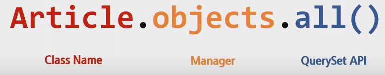
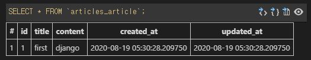
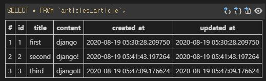

# 0819 Django

### Model

- 데이터에 대한 단 하나의 정보 소스
- 저장된 데이터베이스의 구조(layout)를 의미
- 사용자가 저장하는 데이터들의 필수적인 필드들과 동작들을 포함
- django는 model을 통해 데이터에 접속하고 관리
- 일반적으로 각각의 model은 하나의 데이터베이스 테이블에 매핑

---

#### Database

- 데이터베이스(DB)
  - 체계화된 데이터의 모임
- 쿼리(Query) - 질문
  - 데이터를 조회하기 위한 명령어
  - 조건에 맞는 데이터를 추출하거나 조작하는 명령어

---

#### Database의 기본 구조

- 스키마(schema) - structure

  - 데이터베이스의 구조와 제약 조건(자료의 구조, 표현 방법, 관계)에 관련한 전반적인 명세를 기술한 것.

- 테이블(tabel)

  - 열(컬럼/필드)과 행(레코드/값)의 모델을 사용해 조직된 데이터 요소들의 집합.

     SQL 데이터베이스에서는 테이블을 관계라고도 한다.

  - 필드/컬럼/속성 (열)

  - 레코드/행/튜플 (행)

- DB가 여러 테이블을 담고 있다. (DB는 여러 테이블의 집합)

- 열(Column) - 각 열에는 고유한 데이터 형식이 지정된다. - Interger, Text, Null(값이 없음) 등

- 행(Row), 레코드 - 테이블의 데이터는 행에 저장된다. 즉, user 테이블에 4명의 고객정보가 저장되어 있으면, 행은 4개가 존재한다.

- PK(기본키) - 각 행의 고유값으로 Primary Key로 불린다. (무결성원칙) 반드리 설정하여야하며, 데이터베이스 관리 및 관계 설정시 주요하게 활용된다.

---

## Model

### ORM

##### "Object-Relational-Mapping은 객체 지향 프로그래밍 언어를 사용하여 호환되지 않는 유형의 시스템간에(Django - SQL)데이터를 변환하는 프로그래밍 기술이다. 이것은 프로그래밍 언어에서 사용할 수 있는 '가상 객체 데이터베이스'를 만들어 사용한다."

DB를 조작하기 위해서는 SQL이라는 언어를 써야하는데, 중간에 ORM이라는 것을 장고에서 사용해서 Python만 쓰면 ORM이 DB와의 SQL문으로 바꿔서 DB조작하고 다시 Python Object로 돌려주는 SQL statement를 알아서 해준다. Model에서는 class 중심으로. view에서는 func 중심. model.py를 사용

- 장점
  - SQL을 잘 알지 못해도 DB 조작이 가능
  - SQL의 절차적 접근이 아닌 객체 지향적 접근으로 인한 높은 생산성
- 단점
  - ORM 만으로 완전한 서비스를 구현하기 어려운 경우가 있음 - Python만으로 DB를 모두 다 설계하기 어려운 경우가 있다.(SQL을 전혀 안 쓰고는 구현이 좀 어려울 수 있다.)
- 현대 웹 프레임워크의 요점은 웹 개발의 속도를 높이는 것. (생산성)

#### 우리는 DB를 객체(object)로 조작하기 위해 ORM을 사용한다.

---

#### Django - models.py

##### CharField()

- 길이에 제한이 있는 문자열을 넣을 때 사용
- max_length가 필수인자 (기본값은 max_length=None)
- 필드의 최대 길이, 데이터베이스와 django의 유효성검사에서 사용
- input 태그가 기본

##### TextField()

- 글자의 수가 많을 때 사용
- `<textarea>` 라는 기본 태그

##### DateTimeField()

- 최초 생성 일자 : `auto_now_add=True` (기본값은 False)
  - django ORM이 최초 데이터 입력시에만 현재 날짜와 시간으로 갱신
  - 테이블에 어떤 데이터를 최초로 넣을 때 들어가는 값
- 최종 수정 일자 : `auto_now=True` (기본값은 = False)
  - django ORM 이 save를 할 때마다 현재 날짜와 시간으로 갱신

---

## Migrations

- django가 model에 생긴 변화(필드를 추가했다던가 모델을 삭제했다던가 등)를 반영하는 방법
- 마이그레이션 실행 및 DB 스키마를 다루기 위한 몇가지 명령어
  - makemigrations (0001_initial.py -> ORM -> SQL -> DB)
  - migrate
  - sqlmigrate
  - showmigrations

###### **Migrations Commands**

- makemigrations
  
  - model을 변경한 것에 기반한 새로운 마이그레이션(데이터베이스 설계도)을 만들 때 사용
  - model을 활성화하기 전에 DB 설계도를 작성하는 것과 같음
  - 변경할 때마다 다시 makemigrations를 하여 변경사항을 업데이트 (마치 git)
  - 생성된 마이그레이션 파일은 데이터베이스 스키마를 위한 버전관리 시스템이라고 생각
  
- migrate
  
  - 작성된 마이그레이션 파일들을 기반으로 실제 DB에 반영 -> 이 시점에 테이블이 생성됨
  
  - db.sqlite3 라는 데이터베이스 파일에 테이블을 생성
  - model에서의 변경사항들과 DB의 스키마가 동기화를 이룸
  
- sqlmigrate
  
  - 마이그레이션에 대한 SQL 구문을 보기 위해 사용
  - 해당 마이그레이션 파일이 SQL 문으로 어떻게 해석되어서 동작할지 미리 확인하기 위한 명령어
  
- showmigrations
  
  - 프로젝트 전체의 마이그레이션과 각각의 상태를 확인하기 위해 사용
  - 마이그레이션 파일들의 migrate 여부를 확인하기 위한 명령어
  - `[x]` 체크표시를 통해 상태를 보여줌

#### Model 작성의 중요 3단계 - 순서를 반드시 지켜야함

1. models.py : 변경사항(작성, 수정, 삭제) 발생
2. makemigrations : 마이그레이션(설계도) 만들기
3. migrate : DB에 적용

---


## DB API : 데이터베이스에 명령을 보내는(python 구문)

- django가 기본적으로 ORM을 제공함에 따른 것으로 DB를 편하게 조작할 수 있도록 도와줌
- Model을 만들면 django는 객체들을 만들고 읽고 수정하고 지울(crud : create read update delete) 수 있는 database-abstract API를 자동으로 만듦
- database-abstract API 혹은 database-access API 라고도 함

#### DB API 구문 - Making Queries(명령어를 만든다)



Class 뒤쪽에 DB API인 쿼리셋 API 중 하나인 .all()을 쓰기 위해서 중간에 .objects라는 manager가 있다.

.all() : 모든걸 달라는 동작

### DB API

- Manager
  - django 모델에 데이터베이스 query 작업이 제공되는 인터페이스
  - 기본적으로 모든 django 모델 클래스에 .objects라는 Manager를 추가
- QuerySet(명령어들의 집합)
  - 데이터베이스로부터 전달받은 객체 목록
  - queryset 안의 객체는 0개, 1개 혹은 여러 개일 수 있음
  - 데이터베이스로부터 조회, 필터, 정렬 등을 수행할 수 있음

### QuerySet API

- 데이터베이스 조작을 위한 다양한 QuerySet API method들은 해당 공식문서를 반드시 참고
- https://docs.djangoproject.com/en/3.1/ref/models/querysets/#queryset-api-reference

---


### CRUD

> 대부분의 컴퓨터 소프트웨어가 가지는 기본적인 데이터 처리 기능인
>
> Create(생성), Read(읽기), Update(갱신), Delete(삭제)를 묶어서 일컫는 말

- django 내에서 CRUD를 하는 방법
- 우선 pip install django-extensions를 하고 settings의 apps 에 추가한다 (third-party)
- python manage.py shell_plus로 쉘을 연다

---


### Create

##### 데이터를 작성하는 3가지 방법

1. 첫번째 방법

   - article = Article() : 모델 클래스로부터 인스턴스 생성
   - article 인스턴스로 클래스 변수에 접근해 해당 인스턴스 변수를 변경 (`article.title = 'first'`)
   - article.save() 메서드 호출 -> db에 실제로 저장이 끝

2. 두번째 방법

   - class로 인스턴스 생성 시 keyword 인자를 함께 작성
   - `article = Article(title='second', content='django!')`
   - article.save() 메서드 호출 -> db에 실제로 저장이 끝

3. 세번째 방법

   - create() 메서드를 사용하면 쿼리셋 객체를 생성하고 save() 하는 로직이 한번의 step으로 가능

   - Article.objects.create(titme='third', content='django!!')

> 데이터를 작성하는 첫번째 방법

```python
article = Article()   # 인스턴스 생성. Article은 미리 만들어 둔 class
article.title = 'first' # 인스턴스로 클래스 변수 접근해 인스턴스 변수 변경
article.content = 'djnago'
article.save() # 테이블에 변수 넣은거. 인스턴스로 save 메서드 호출. -> DB에 게시글 작성
# 이때 article 해보면 드디어 none이 아닌 1을 가지고 있음
```

 # 붙어 있는 부분은 무시하면 됨

> 데이터를 작성하는 두번째 방법

```python
article = Article(title='second', content='django!') # 키워드 인자로 한번에 넣어서 진행
article.save() # 위에서 하나 넣었기 때문에 2번이 할당됨
article.pk # 해보면 2가 나옴 (column에는 id)
```

> 데이터를 작성하는 세번째 방법

```python
Article.objects.create(titme='third', content='django!!') # 하면 바로 output으로 3이 db에 저장이 되었다는 메시지가 나옴. 즉 save()를 안해도 된다.
```



---


### Read

##### 데이터를 읽는 방법

```python
Article.objects.all() # 을 하면
<QuerySet [<Article: Article object (1)>, <Article: Article object (2)>, <Article: Article object (3)>]> # 과 같은 보기 힘든 표현이 나온다.
```

##### models.py 에서 만들어진 class 내에

```python
from django.db import models

# Create your models here.
class Article(models.Model):  
    title = models.CharField(max_length=10)  
    content = models.TextField() 
    created_at = models.DateTimeField(auto_now_add=True)  
    updated_at = models.DateTimeField(auto_now=True)  

    def __str__(self):
        return f'{self.pk}번 글의 제목은 {self.title}'
    
# 과 같은 형태로 사람이 읽기 편하게 바꿔주는게 좋다
```

`all()`

- `QuerySet` return
- 리스트는 아니지만 리스트와 거의 비슷하게 동작(조작할 수 있음)


`get()`

- 객체가 없으면 `DoesNotExist` error가 발생
- 객체가 여러개일 경우는 `MultipleObjectsReturned` error가 발생 (django값이 여러개인 경우 등)
  - `Article.objects.filter(content='django!')` 이 에러를 방지하고 싶다면 이 형태로 쿼리셋을 리턴받음. 이 경우 찾는게 없어도 빈 쿼리셋이 나옴
- 위와 같은 특징을 가지고 있기 때문에 unique 혹은 Not Null 특징을 가지고 있으면 사용할 수 있다. `Article.objects.get(pk=1)` 이와 같은 형태로 ex) pk


`filter()`

- 지정된 조회 매개 변수와 일치하는 객체를 포함하는 QuerySet을 return

---


### Update

> 몇 번 글을 수정할지 정하는거부터 시작 -> `.get()`

```python
article.title # = 'first' 상태에서
article.title = 'mateo'
article.save() # 하면 수정
```

---


### Delete

```python
article = Article.objects.get(pk=1) # 상태에서
article.delete() # 하면 삭제
# 1번 pk는 다시 재사용되지 않는다. 새로 만들면 4번 pk를 사용
```

---

> Django admin 으로 CRUD를 쉽게 할 수도 있다. 
>
> `python manage.py createsuperuser` 로 계정을 만들고 Djnago 관리를 할 수 있다.
>
> **But**, migrate를 먼저 해서 DB를 구축을 한 뒤에 superuser를 만들어야함 (그래야 superuser가 저장이 됨)

