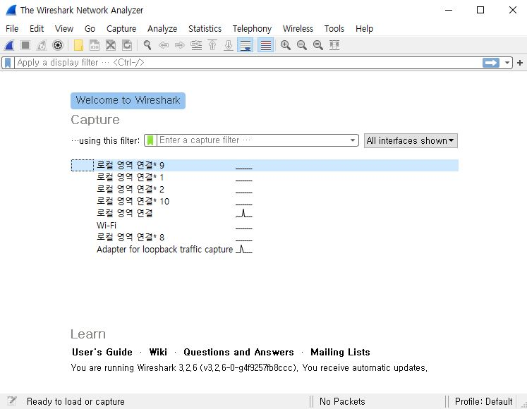
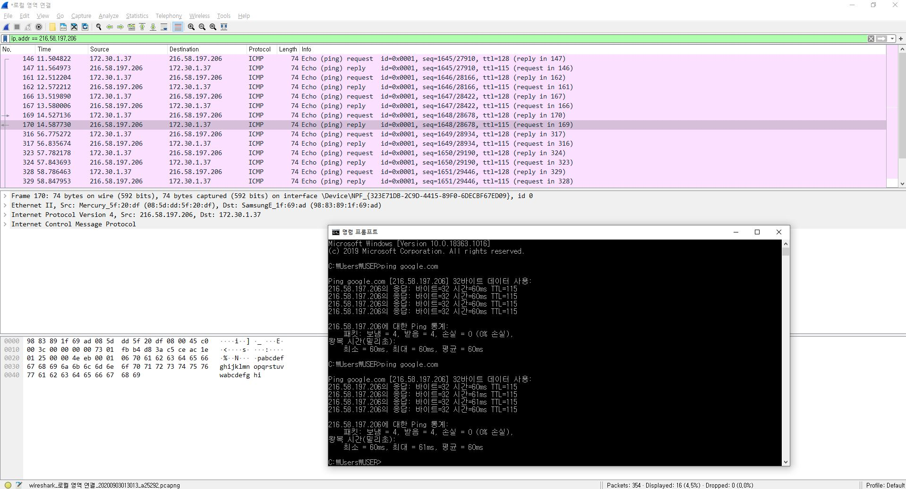

# 3주차_2 와이어샤크(WireShark)

[TOC]

## 0. 시작 전에

LAN 분석툴은 네트워크상의 패킷을 가져와서 그 의미를 화면에 표시해주는 소프트웨어이다.

LAN(근거리 통신망 : Local Area Network)이란, 회사나 가정에서 케이블로 연결된 로컬 네트워크를 말한다. PC로 홈페이지를 보거나 이메일을 보낼때 전송되는 정보는 실제로 LAN 케이블 내부를 전기 신호 형태로 흐르게 된다. LAN 분석기는 LAN 케이블을 지나는 전기 신호를 패킷 형태의 데이터로 가져와서 의미를 조사할 수 있다.

## 1. WireShark란 ?

와이어샤크(WireShark)는 GPL(General Public License)로 배포되고 있는 자유 및 오픈 소스 네트워크 패킷 캡처 및 분석 SW이다. 피 한 방울만 떨어져도 감지해내는 상어처럼 통신망을 감시한다는 취지라고 한다.

- 참고로 이런 패킷 캡쳐 프로그램도 보안전문가가 사용하면 바이러스나 해킹을 차단하는 훌륭한 도구가 되지만, 반대로 해커가 사용할 경우 개인정보 탈취를 위한 강력한 무기가 된다.

#### 1.1 와이어샤크의 이용 목적

와이어샤크 공식 문서에 따르면 와이어샤크를 사용하는 목적은 다음과 같다.

- 네트워크 관리자가 네트워크의 장애를 해결하기 위해 사용
- 보안 기술자가 보안 문제를 테스트, 확인하기 위해 사용
- 개발자가 프로토콜 구현에 대해 디버그하기 위해 사용
- 사람들이 네트워크 프로토콜의 내용에 관해 학습하기 위해 사용
  - 이 부분이 가장 주된 이용 목적이고, 우리 역시 와이어샤크를 이용해 프로토콜을 학습해 보자.

#### 1.2 와이어샤크의 주요기능

- 네트워크 인터페이스에서 raw 패킷 캡쳐
- 패킷 내용을 자세하게 표시
- 패킷 캡쳐 데이터를 열거나 저장
- 다른 많은 LAN 분석툴이 캡쳐한 캐핏 캡쳐 데이터를 변환해서 읽어들이거나 저장
- 다양한 조건으로 패킷을 필터링하거나 검색
- 필요한 패킷만 특정 색으로 표시
- 다양한 통계 생성
- 플러그인을 제작해서 자유롭게 기능 확장

#### 1.3 와이어샤크 기본 작동 개념

같은 네트워크 구간의 상훈과 미나는 메신저나 이메일 등을 통해 대화를 주고 받는다.

여기서 Wireshark를 사용하는 제 3자는 이 둘 사이의 네트워크로 돌아다니는 패킷을 수신하여 저장한다. 이 때, PCAP라는 파일 포맷으로 저장된다.

PCAP는 Packet Capture의 약자로, 네트워크 트래픽을 캡쳐하는 API구성이다. Wireshark는 자체 프로그램으로 네트워크 트래픽을 캡쳐하는 것이 아니고, 운영체제에서 지원하는 캡쳐 라이브러리를 이용하여 수집한다. (윈도우의 경우 Winpcap)

##### 1.3.1 WinPcap

- 왜 패킷 캡쳐 라이브러리가 필요할까 ?

  일반적으로 어플리케이션에서는 소켓을 경유해 데이터를 송수신한다. 소켓이란 OS의 기능 중 하나로, 다른 프로그램에서 이용하기 위한 함수를 말한다. 소켓을 경유하면 네트워크를 지나는 데이터를 직접 캡쳐할 수 없게 된다. 이 때, 패킷 캡쳐 라이브러리를 도입하면 소켓을 bypass해 직접 LAN 분석툴에서 네트워크를 지나는 모든 패킷을 조작할 수 있게 된다.

  

#### 1.4 와이어샤크의 장단점

- 장점
  - 패킷 내용 상세표시와 패킷 분석이 장점이다.
  - 버전업 빈도가 잦다.
  - 와이어샤크는 상용 LAN 분석툴이 캡쳐한 패킷이 저장한 파일(캡쳐 파일)을 읽어들여 다른 파일 형식으로 출력하거나 여러 개의 캡쳐 파일을 결합해 이를 바탕으로 분석을 수행할 수 있다.
- 단점
  - 상용 LAN 분석툴에 비해 트렌트 기능이나 리포트 기능, Threshold 기능이 비교적 약한 편이다.
  - IDS(Intrusion Detection System)로 설계되어 있지는 않아 네트워크 침해를 감지해 화면에 경고 메시지를 표시할 수 없다.
  - 패킷을 생성해 네트워크로 전송할 수는 없다. 어디까지나 와이어샤크는 네트워크를 측정하는 기능만 사용.

---

## 2. 와이어샤크 실습 예제

와이어샤크를 실행시키면 나오는 화면. 연결되어 있는 로컬 영역 연결을 더블클릭 했다.

간단히 인터페이스 기능을 정리하자면 다음과 같다.

**①** : 시작

**②** : 종료

**③** : 다시시작

**④** : Packet List(패킷 리스트 영역) = 호스트 간에 주고받은 패킷을 나열해 놓는 부분

- No : 패킷이 수집된 순서를 나타냄
- Time : 패킷 캡쳐를 시작하고 걸린 시간을 나타냄
- Source ( 패킷을 보낸 주소 ) ↔ Destination ( 패킷이 도착한 주소 )
- Protocol : 패킷 프로토콜 정보
- Length : 패킷의 길이(크기)를 bytes로 나타냄
- info : 패킷의 상세 정보

**⑤** : Packet Details(패킷 상세 영역) = ④에서 주고받은 패킷의 내부 헤더 정보, 즉 이 패킷들을 어떤 규칙이나 전송 기준으로 주고받았는지를 보여준다.

**⑥** : Packet Bytes(패킷 데이터 영역) = 실제 주고받은 내용을 16진수나 ASCII 문자 코드 등으로 보여준다.

​	맨 좌측의 회색 숫자 부분은 패킷의 위치를 나타내고, 

​	중앙의 16진수로 표시된 부분은 패킷의 위치를 나타내고,

​	우측 문자 + 기호 부분은 데이터의 내용을 ASCII 문자로 표시해 주는 영역

이 부분만 확인해도 대략적인 정보를 얻을 수 있다.

예를 들어 "소켓을 이용해서 긴 메시지를 보낸다고 할 때 잘 가는지를 확인하려면" TCP 프로토콜로 내 ip(Source)에서 도착지로 패킷이 얼마나(length) 갔는지를 확인할 수 있다.

뭔가 에러가 있을 때는 빨간색 혹은 검은색으로 패킷이 오고 가는 것을 확인할 수 있다. (색 변경가능)

#### 2.1 Wireshark 필터링

와이어샤크를 사용하면 실시간으로 수 많은 패킷을 수집하기 때문에 내가 원하는 패킷을 찾기가 힘들다.

그런 문제점을 극복하기 위해 필터링을 사용할 수 있다.

와이어샤크 상단 부분을 보면 apply a display filter 라는 부분이 있다. 그곳에 필터링 문법을 입력한다.

이곳에 ip라고만 쳐도 사용할 수 있는 필터의 예시를 알려준다.

먼저 본인 PC cmd창에서 google.com 으로 ping 명령어를 사용해보았다.

그리고 필터링 입력 창에 ip.addr == 216.58.197.206 (google.com ip) 라고 입력해 해당 ip 에 해당하는 내용만을 보았다.

cmd 창을 보면 4번 ping을 두 번 보냈는데 와이어샤크 창을 보게되면 request 8번, reply 8번 총 16번의 교환이 있었음을 확인할 수 있다.

- 유용한 필터링 식

  - eth.addr == 00:3f:1e:00:00:23 //출발지나 목적지 MAC 주소로 검색
  - ip.addr == 192.168.0.2 // 출발지나 목적지 IP주소로 검색
  - tcp.port == 3306 // TCP 출발지나 목적지 포트 번호로 검색
  - ip.src != 10.1.2.3 // 출발지 IP주소가 해당 IP주소가 아닌것 검색
  - eth.dst == 00:3f:1e:00:00:23 // 목적지 MAC주소 검색

- 사용 예)

  - tcp dst port 8888 // 목적지가 tcp 8888 포트인 패킷

    ip src host 192.168.0.13 // 출발지 IP 주소가 192.168.0.13인 패킷

    not icmp // icmp가 아닌것 모두 검색

    eth.addr == 28:16:ad:00:33:04 // 출발지나 도착지 MAC주소로 검색

    

기타 비교 연산자나 논리 표현도 가능하고 필터링도 다양하므로 구글링해보기를 추천한다.

#### 2.2 HTTP와 HTTPS 비교해보기

- http 접속

HTTP 접속과 HTTPS 접속을 비교하기위해 HTTP로 접속해도 HTTPS로 리다이렉트 되지 않는 사이트를 선정했다. 불명예를 가진 페이지는 학교 홈페이지다;

http://www.kau.ac.kr 로도, https://www.kau.ac.kr 로도 접속이 가능했다.

Wireshark를 켜둔 채 브라우저를 통해 http://www.kau.ac.kr 에 접속하면 Wireshark에 캡쳐된다. 수많은 데이터에 파묻혀 버리지 않도록 다음과 같은 필터를 사용했다.

`ip.addr == 203.253.150.56 && http`

이를 통해 source나 destination의 아이피가 `203.253.150.56` 이고, 프로토콜이 HTTP인 패킷만 보여주게 되었다. 서버 아이피는 cmd 에서 ping 명령어를 실행해 확인했다.

캡쳐된 패킷 중 하나를 선택해 내용을 살펴보았다.

http://www.kau.ac.kr 에게 /images/main/inp01.png 를 요청하는 HTTP 메시지이다.

User-Agent 헤더를 통해 클라이언트가 크롬을 사용하고 있다는 점을 알 수 있고, Referer를 통해 클라이언트가 http://www.kau.ac.kr/css/main_0418.css 에서 넘어왔다는 것을 알 수 있다. 이렇게 Referer을 보면 페이지의 방문자 유입 경로와 같은 정보를 얻을 수 있다.

쿠키도 확인할 수 있는데, 여기서는 `JSESSIONID` 라는 쿠키가 사용되었다. 이것은 서버에서 JSP를 실행할 때 세션 ID를 구분하려는 목적으로 사용되는 쿠키라고 한다.

앞선 요청에 대한 서버의 응답 메시지이다. Status line에 요청이 잘 처리되었다는 의미인 200 OK를 확인할 수 있다.

Last-Modified 헤더를 통해 캐시된 파일이 2019년 4월 4일 목요일에 마지막으로 수정되었다는 것과 Content-Type 헤더를 통해 png 이미지라는 것도 알 수 있다.

아래 내용이 조금 잘렸는데, Png 파일이 담겨있는 body가 있다.

- https 접속

HTTPS는 현재 SSL을 발전시킨 TLS 프로토콜을 사용한다. 그래서 Wireshark 필터를 먼저 수정했다.

`ip.addr == 203.253.150.56 && ssl`

그 뒤 브라우저에서 https://www.kau.ac.kr 로 접속하고 와이어샤크를 확인했다.

우선, 접속 과정에서 HTTP와 다른 점을 확인할 수 있다. HTTPS로 접속할 때는 TLS handshake 과정을 거친다.

IBM의  [An overview of the SSL or TLS handshake](https://www.ibm.com/support/knowledgecenter/en/SSFKSJ_7.1.0/com.ibm.mq.doc/sy10660_.htm)에 따르면 TLS handshake 과정에서는 서버와 클라이언트 인증서를 검증하고, 클라이언트 키를 교환한다. 앞서 캡쳐된 패킷에서 보듯, 이 과정에서 클라이언트와 서버는 Client Hello, Server Hello, Certificate, Server Hello Done 메시지를 주고받는다. 이 과정을 거친 후에야 클라이언트와 서버는 본격적으로 데이터를 교환한다.

Wireshark에서 TLS handshake 이후 주고받는 패킷 중 아무거나 열어봤다.

클라이언트와 https://www.kau.ac.kr 가 주고받은 해당 패킷 컨텐츠 타입이 Application Data 라는 것을 제외하고는 얻을 수 있는 정보가 없다. HTTP로 접속할 때는 각종 정보를 볼 수 있었지만, HTTPS로 접속할 때는 패킷이 암호화되어 내용을 알 수 없다.

만약 어떤 사람이 HTTP 서버에 접속했을 때, 악의를 가진 사람이 그 사람의 패킷을 가로챈다면 그 사람이 어떤 페이지에서 무엇을 했는지 알아낼 수 있을 것이라는 결론이다.

와이어샤크는 위와 같이 단순하게 패킷의 정보를 분석하는 것 뿐만아니라, 여러개의 캡쳐 파일을 결합해 분석할 수 있기 때문에, 다양한 패킷 정보를 결합하여 분석하는데 사용할 수 있을 것이다.

---

#### References

[Wireshark](https://www.wireshark.org/)

[와이어샤크 위키](https://ko.wikipedia.org/wiki/%EC%99%80%EC%9D%B4%EC%96%B4%EC%83%A4%ED%81%AC)

[Pcap](https://ko.wikipedia.org/wiki/Pcap)

[[네트워크]와이어샤크란?](https://12bme.tistory.com/512)

[HTTPS는 어떻게 다를까?](https://parksb.github.io/article/24.html)

